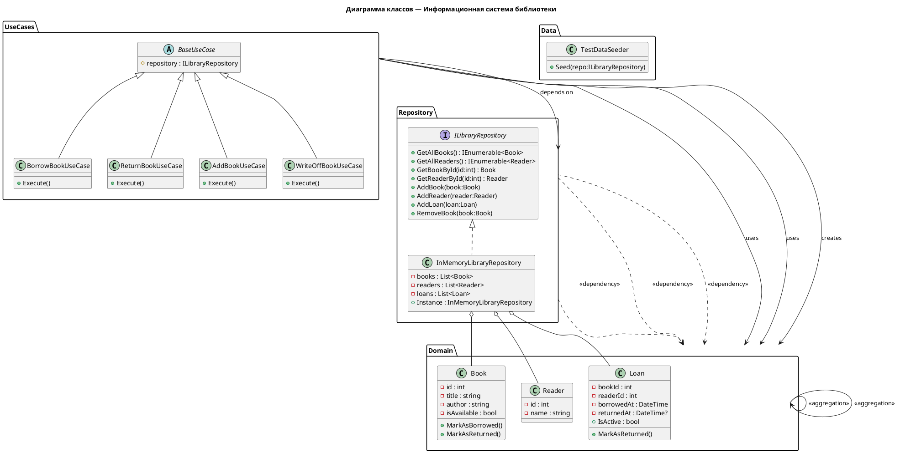

```plantuml
@startuml
title Диаграмма классов — Информационная система библиотеки

package Domain {
class Book {
- id : int
- title : string
- author : string
- isAvailable : bool
+ MarkAsBorrowed()
+ MarkAsReturned()
}

    class Reader {
        - id : int
        - name : string
    }

    class Loan {
        - bookId : int
        - readerId : int
        - borrowedAt : DateTime
        - returnedAt : DateTime?
        + MarkAsReturned()
        + IsActive : bool
    }
}

package Repository {
interface ILibraryRepository {
+ GetAllBooks() : IEnumerable<Book>
+ GetAllReaders() : IEnumerable<Reader>
+ GetBookById(id:int) : Book
+ GetReaderById(id:int) : Reader
+ AddBook(book:Book)
+ AddReader(reader:Reader)
+ AddLoan(loan:Loan)
+ RemoveBook(book:Book)
}

    class InMemoryLibraryRepository {
        - books : List<Book>
        - readers : List<Reader>
        - loans : List<Loan>
        + Instance : InMemoryLibraryRepository
    }

    ILibraryRepository <|.. InMemoryLibraryRepository
    InMemoryLibraryRepository o-- Book
    InMemoryLibraryRepository o-- Reader
    InMemoryLibraryRepository o-- Loan
}

package UseCases {
abstract class BaseUseCase {
# repository : ILibraryRepository
}

    class BorrowBookUseCase {
        + Execute()
    }

    class ReturnBookUseCase {
        + Execute()
    }

    class AddBookUseCase {
        + Execute()
    }

    class WriteOffBookUseCase {
        + Execute()
    }

    BaseUseCase <|-- BorrowBookUseCase
    BaseUseCase <|-- ReturnBookUseCase
    BaseUseCase <|-- AddBookUseCase
    BaseUseCase <|-- WriteOffBookUseCase
}

package Data {
class TestDataSeeder {
+ Seed(repo:ILibraryRepository)
}
}

' Dependencies
UseCases::BorrowBookUseCase --> Domain::Book : uses
UseCases::BorrowBookUseCase --> Domain::Reader : uses
UseCases::BorrowBookUseCase --> Domain::Loan : creates
UseCases::BorrowBookUseCase --> Repository::ILibraryRepository : depends on

Domain::Loan --> Domain::Book : <<aggregation>>
Domain::Loan --> Domain::Reader : <<aggregation>>

Repository::InMemoryLibraryRepository ..> Domain::Book : <<dependency>>
Repository::InMemoryLibraryRepository ..> Domain::Reader : <<dependency>>
Repository::InMemoryLibraryRepository ..> Domain::Loan : <<dependency>>

@enduml
```