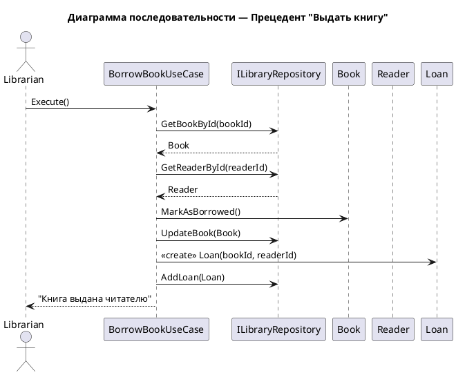

```plantuml
@startuml
title Диаграмма последовательности — Прецедент "Выдать книгу"

actor Librarian
participant "BorrowBookUseCase" as UseCase
participant "ILibraryRepository" as Repo
participant "Book"
participant "Reader"
participant "Loan"

Librarian -> UseCase : Execute()
UseCase -> Repo : GetBookById(bookId)
Repo --> UseCase : Book
UseCase -> Repo : GetReaderById(readerId)
Repo --> UseCase : Reader
UseCase -> Book : MarkAsBorrowed()
UseCase -> Repo : UpdateBook(Book)
UseCase -> Loan : <<create>> Loan(bookId, readerId)
UseCase -> Repo : AddLoan(Loan)
UseCase --> Librarian : "Книга выдана читателю"

@enduml
```
