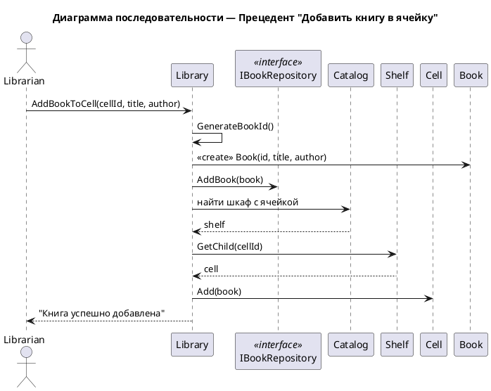

# Сценарий добавления книги в ячейку

## Начало операции
1. Библиотекарь выбирает операцию **"Добавить книгу в ячейку"**.
2. Система запрашивает:
   - Идентификатор ячейки
   - Название книги
   - Автора книги

## Ввод данных
3. Библиотекарь вводит:
   - `cellId` — номер ячейки
   - `title` — название книги
   - `author` — автор книги

## Создание книги
4. Система **генерирует уникальный ID** для книги.
5. Система **создает объект Book** с полученными данными.
6. Система **добавляет книгу** в репозиторий книг.

## Поиск ячейки
7. Система находит **каталог**.
8. Через каталог находит **нужный стеллаж**.
9. В стеллаже находит **конкретную ячейку** по `cellId`.

## Размещение книги
10. Система **помещает книгу в ячейку** (вызывает `cell.Add(book)`).

## Завершение операции
11. Система показывает сообщение: **"Книга успешно добавлена"**.
12. Операция завершена.

## 🔍 Примечание
- **Нет проверки** на дубликаты книг
- **Нет проверки** доступности ячейки (предполагается, что ячейка пуста)
- Книга автоматически становится доступной (`isAvailable = true`)

  

