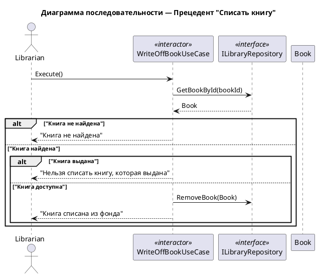

# Сценарий списания книги

## Начало операции

1. Библиотекарь выбирает операцию "Списать книгу" в системе.
2. Система запрашивает идентификатор списываемой книги.

## Поиск книги

3. Библиотекарь вводит номер книги (сканирует штрих-код или вводит вручную).
4. Система ищет книгу по идентификатору.

## Проверка существования книги

5. Если книга не найдена:
   - Система показывает сообщение: "Книга не найдена".
   - Сценарий завершается.

## Проверка статуса книги

6. Если книга найдена:
   - Система проверяет текущий статус книги.

7. Если книга выдана читателю (isAvailable = false):
   - Система показывает сообщение: "Нельзя списать книгу, которая выдана".
   - Сценарий завершается.

## Списание книги

8. Если книга доступна (isAvailable = true):
   - Система удаляет книгу из каталога.
   - Система сохраняет изменения.

## Завершение операции

9. Система показывает сообщение: "Книга списана из фонда".
10. Операция завершена.

